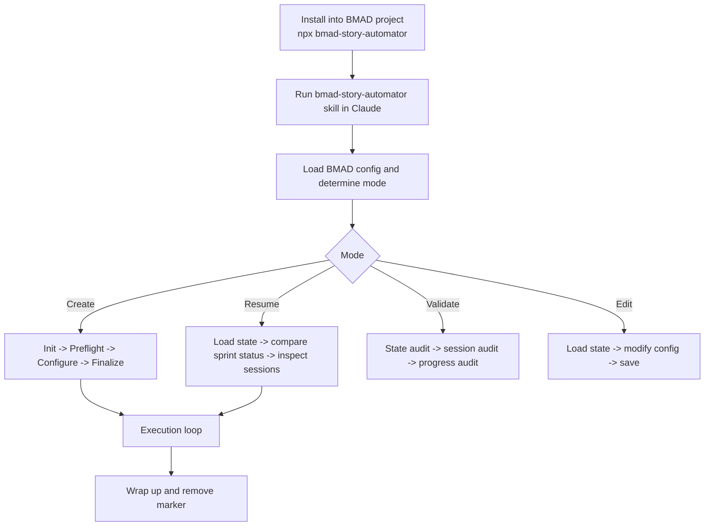
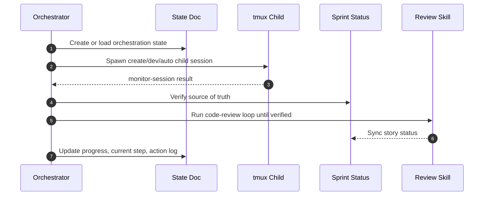

# Story Automator


Portable npm bundle for the BMAD `bmad-story-automator` pure skill. This repo packages:

- the main orchestration skill
- the bundled review skill
- the Python helper runtime that parses stories, builds state docs, spawns tmux sessions, monitors child agents, and verifies review completion

This is the Python port of [`bma-d/bmad-story-automator-go`](https://github.com/bma-d/bmad-story-automator-go). The Go README is the stylistic and operator-facing reference; this repo now documents the Python implementation in the same spirit, but with Python-specific behavior and Codex child-session support.

## Quickstart

Install into the target BMAD project:

```bash
cd /absolute/path/to/your-bmad-project
npx bmad-story-automator
```

Or install from anywhere:

```bash
npx bmad-story-automator /absolute/path/to/your-bmad-project
```

Then run the installed skill from Claude:

```text
Use the bmad-story-automator skill.
```

## Expectations

- This is an orchestrator, not a correctness guarantee. Bad planning artifacts still produce bad implementation runs.
- The orchestrator itself is a Claude skill. Child sessions can use Claude or Codex depending on agent configuration.
- Retrospectives are Claude-only.
- The automator expects sprint planning to be complete before it starts.
- Review completion is gated by verification, not by child-session exit alone.
- If the optional QA automate skill is missing, install still succeeds, but runs should use `Skip Automate = true`.

## What This Is

Story Automator automates the BMAD implementation loop for one or more stories:

1. create story
2. implement story
3. optionally run automate/test generation
4. run adversarial code review with retries
5. commit verified work
6. trigger retrospective when an epic is fully complete

The core runtime model is:

- one orchestrator session
- one markdown state document
- many short-lived tmux child sessions
- one marker file guarding against accidental stop
- `sprint-status.yaml` plus story files as the source of workflow truth

## How It Works





Practical shape:

- create, resume, validate, and edit are first-class modes
- preflight complexity scoring happens before agent selection
- `done` is gated by review verification
- retrospectives fire inside the execution loop, per epic, not only at the very end

## Docs Map

- [How It Works](./docs/how-it-works.md)
- [Story Execution](./docs/story-execution.md)
- [State And Resume](./docs/state-and-resume.md)
- [Agents And Monitoring](./docs/agents-and-monitoring.md)
- [Installation And Layout](./docs/installation-and-layout.md)
- [Review Workflow](./docs/review-workflow.md)
- [CLI Reference](./docs/cli-reference.md)
- [Troubleshooting](./docs/troubleshooting.md)
- [Development](./docs/development.md)

## Requirements

Host requirements:

- `python3` 3.11+
- `tmux`
- Claude Code
- macOS or Linux

Target project requirements:

- `_bmad/` project directory
- `.claude/skills/bmad-create-story`
- `.claude/skills/bmad-dev-story`
- `.claude/skills/bmad-retrospective`
- optional `.claude/skills/bmad-qa-generate-e2e-tests`

If the QA skill is missing, install still succeeds. Run Story Automator with `Skip Automate = true` unless the QA skill is installed.

## Install Verification

Inside a target project:

```bash
cd /path/to/project
test -f .claude/skills/bmad-story-automator/SKILL.md
test -f .claude/skills/bmad-story-automator-review/SKILL.md
.claude/skills/bmad-story-automator/scripts/story-automator --help
grep -n "name: bmad-story-automator" .claude/skills/bmad-story-automator/SKILL.md
grep -n "0 CRITICAL issues remain after fixes" .claude/skills/bmad-story-automator-review/instructions.xml
```

Expected:

- helper CLI prints usage
- the main skill exists
- the bundled review gate exists

## Development Verification

```bash
npm run verify
PYTHONPATH=source/src python3 -m story_automator --help
```

More: [Development](./docs/development.md)

## Publish To npm

Publish steps:

- `npm adduser`
- `npm publish`

More: [Development](./docs/development.md#release)
