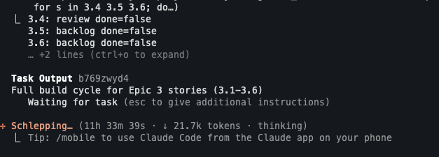

# Story Automator



Portable npm installer for the BMAD `bmad-story-automator` pure skill. The package bundles the story automator workflow, the review workflow, and the Python helper runtime into a target project’s `.claude/skills` tree.

This repository is the Python port of [`bma-d/bmad-story-automator-go`](https://github.com/bma-d/bmad-story-automator-go). It has been tested less than the Go implementation, so treat the Go repository as the more battle-tested reference.

Run this after planning is complete and the target project already has the pure BMAD implementation skills installed.

## Quickstart

```bash
cd /absolute/path/to/your-bmad-project
npx bmad-story-automator
```

Then invoke the installed skill from Claude:

```text
Use the bmad-story-automator skill.
```

Or install into a project explicitly:

```bash
npx bmad-story-automator /absolute/path/to/your-bmad-project
```

## What This Installs

The installer writes:

- `.claude/skills/bmad-story-automator`
- `.claude/skills/bmad-story-automator-review`

The main skill includes:

- `SKILL.md`
- `workflow.md`
- `steps-c/`, `steps-v/`, `steps-e/`
- `data/`
- `templates/`
- `scripts/story-automator`
- `src/story_automator`
- `pyproject.toml`

The review skill remains self-contained with its own `SKILL.md`, `workflow.yaml`, `instructions.xml`, and `checklist.md`.

The installer does not create Claude command wrappers. It always removes the obsolete `.claude/commands/bmad-bmm-story-automator-py.md` shim if present, and removes previously generated story-automator command shims only when they still point at old workflow-root installs.

Legacy story-automator installs under `_bmad/bmm/4-implementation/...` or `_bmad/bmm/workflows/4-implementation/...` are backed up during migration. Those locations are no longer primary install targets.

## Requirements

Host requirements:

- `python3` 3.11+
- `tmux`
- Claude Code
- macOS or Linux

Target project requirements:

- `_bmad/` project directory
- `.claude/skills/bmad-create-story`
- `.claude/skills/bmad-dev-story`
- `.claude/skills/bmad-retrospective`
- optional `.claude/skills/bmad-qa-generate-e2e-tests`

If the QA skill is missing, install still succeeds. Run story-automator with `Skip Automate = true` unless you install `.claude/skills/bmad-qa-generate-e2e-tests`.

## Package Layout

Payload copied into target projects:

- `payload/.claude/skills/bmad-story-automator/`
- `payload/.claude/skills/bmad-story-automator-review/`

Package scripts:

- `install.sh`
- `bin/bmad-story-automator`
- `package.json`

Bundled runtime source:

- `source/pyproject.toml`
- `source/scripts/story-automator`
- `source/src/story_automator/`

## Verify Install

Manual checks inside a target project:

```bash
cd /path/to/project
test -f .claude/skills/bmad-story-automator/SKILL.md
test -f .claude/skills/bmad-story-automator-review/SKILL.md
.claude/skills/bmad-story-automator/scripts/story-automator --help
grep -n "name: bmad-story-automator" .claude/skills/bmad-story-automator/SKILL.md
grep -n "0 CRITICAL issues remain after fixes" .claude/skills/bmad-story-automator-review/instructions.xml
```

Expected:

- command help output from `story-automator`
- skill name `bmad-story-automator`
- a matching `CRITICAL issues remain` line in the review instructions

## Development Verification

```bash
npm run verify
PYTHONPATH=source/src python3 -m story_automator --help
```

## Publish To npm

Publish steps:

- `npm adduser`
- `npm publish`
