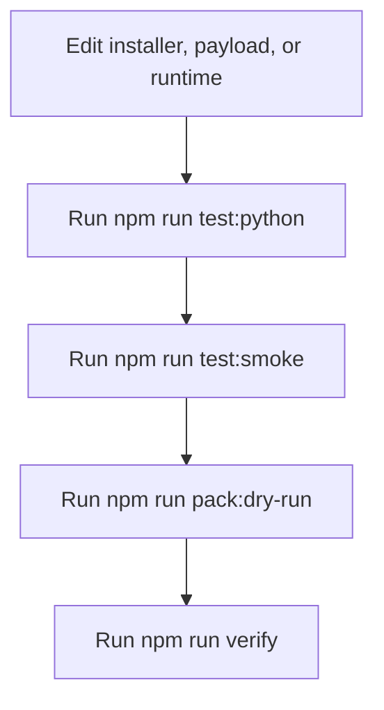

# Development

This doc covers local verification, smoke testing, packaging, and release steps for this repo itself.

## Local Verify

Primary checks:

```bash
npm run verify
PYTHONPATH=source/src python3 -m story_automator --help
```

`npm run verify` expands to:

- `npm run test:python`
- `npm run pack:dry-run`
- `npm run test:smoke`

## Smoke Test Coverage

The smoke suite validates:

- installer behavior
- packed `npx` install behavior from the generated tarball
- required and optional dependency handling
- legacy backup behavior
- installed skill layout
- installed runtime policy, prompt templates, and parse contracts
- prompt-building behavior for Claude and Codex child sessions

## Repo Verification Flow



## Packaging Surface

Important package parts:

- `bin/bmad-story-automator`
- `install.sh`
- `payload/`
- `source/`
- `README.md`
- `ref.png`

The published package bundles both the install payload and the Python runtime source.

## Runtime Entry During Development

The shell wrapper used in installed projects is mirrored in this repo:

```text
source/scripts/story-automator
```

It runs:

```text
python3 -m story_automator
```

with `PYTHONPATH` pointed at `source/src`.

## What To Re-Check After Runtime Changes

If you change:

- `commands/tmux.py`: re-check spawn, command building, monitor behavior, Codex vs Claude handling
- `commands/orchestrator.py`: re-check state summary, marker behavior, sprint-status verification
- `install.sh`: re-check dependency validation, copy layout, backups, shim cleanup
- payload step files: re-check docs, prompts, and smoke expectations

## Release

Publish steps:

- `npm adduser`
- `npm publish`

Recommended release checklist:

1. `npm run verify`
2. use [$secrets](/Users/joon/.agents/skills/secrets/SKILL.md) for npm auth material; search exact key names, then `secrets load <KEY>` into the publish shell; never print token values
3. inspect the package dry-run output
4. confirm README and docs match shipped behavior
5. publish

## Read Next

- [Installation And Layout](./installation-and-layout.md)
- [CLI Reference](./cli-reference.md)
