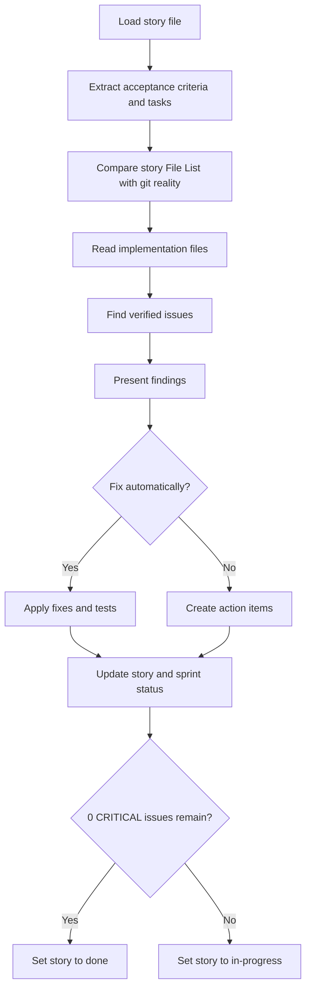
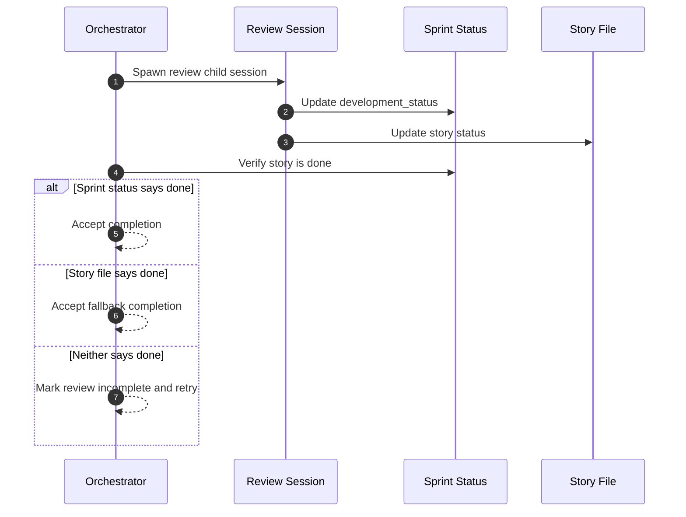

# Review Workflow

Story Automator bundles its own review workflow because story completion depends on a stricter rule than generic review.

## Why Review Is Bundled

The bundled review skill exists so the orchestrator can enforce:

- adversarial review against actual implementation
- verification against story claims and git reality
- automatic fix loops
- a zero-critical-issues completion gate

The orchestrator should not move a story to `done` just because a generic review step said “looks good.”

## Review Inputs

The review workflow reads:

- the story file
- acceptance criteria
- tasks and subtasks
- Dev Agent Record and File List
- actual git changes
- implementation files
- `sprint-status.yaml`

It explicitly excludes non-source review surfaces such as `_bmad/`, `_bmad-output/`, and unrelated IDE configuration outside the allowed skill paths.

## Review Flow

## Severity Model

The workflow treats these as the real blockers:

- tasks marked complete but not actually done
- acceptance criteria not actually implemented
- security issues
- any remaining critical findings after auto-fix

High, medium, and low findings still matter, but the orchestration gate is about critical issues.

## Completion Gate

This is why `monitor-session --workflow review --story-key ...` exists.

## Git Reality vs Story Claims

One important review behavior is the cross-check between:

- files claimed in the story file
- actual files changed in git

This catches:

- undocumented changed files
- claimed files with no git evidence
- incomplete or misleading Dev Agent Record updates

## Sprint Status Sync

When review finishes:

- `done` means zero critical issues remain after fixes
- `in-progress` means one or more critical issues still remain

The review skill tries to sync `development_status[story_key]` in `sprint-status.yaml` accordingly.

## Why The Orchestrator Re-Checks Review

Review completion is verified again by the helper runtime because:

- the child session can exit before workflow truth is updated
- Codex and Claude have different runtime behavior
- monitor output alone is not trusted as the final gate

## Read Next

- [Story Execution](./story-execution.md)
- [Agents And Monitoring](./agents-and-monitoring.md)
